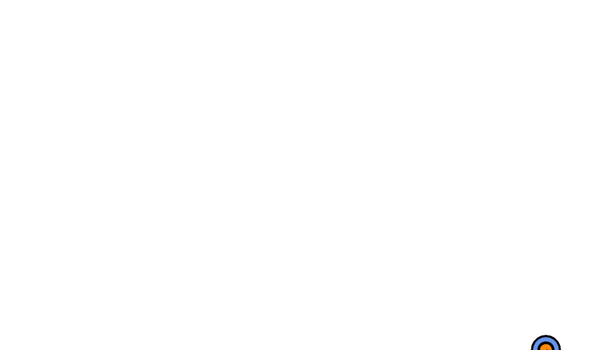

# The Seeker - Boid Seeks Mouse

Mouse seeking behavious modeled using location, velocity, acceleration, and perception.

Built as a code Kata with an intent to learn the [openFrameworks C++ creative coding toolkit](https://openframeworks.cc/).

## Source Code

A C++ program written in the `setup/update/draw` [openFrameworks style](https://openframeworks.cc/ofBook/chapters/how_of_works.html):

* [ofApp.cpp](https://github.com/stungeye/Seeker-Boid-with-openFrameworks/blob/master/openFrameworksApp11/src/ofApp.cpp) - The app setup along with its update/draw loop.
* [ofApp.h](https://github.com/stungeye/Seeker-Boid-with-openFrameworks/blob/master/openFrameworksApp11/src/ofApp.h) - Two variables for the main app: `Boid theBoid` and `Mouser theMouse`

### The Boid Source

* [boid.cpp](https://github.com/stungeye/Seeker-Boid-with-openFrameworks/blob/master/openFrameworksApp11/src/boid.cpp) - Seeking behaviour and the code to draw the seeker as a circle with line nose: O- 
* [boid.h](https://github.com/stungeye/Seeker-Boid-with-openFrameworks/blob/master/openFrameworksApp11/src/boid.h) - Object props for location, velocity and acceleration. Constants to change behaviour and draw.

### The Mouser Source

* [Mouser.cpp](https://github.com/stungeye/Seeker-Boid-with-openFrameworks/blob/master/openFrameworksApp11/src/Mouser.cpp) - A circular pointer that tracks the x/y location of the mouse.
* [Mouser.h](https://github.com/stungeye/Seeker-Boid-with-openFrameworks/blob/master/openFrameworksApp11/src/Mouser.h) - Object prop for location. Constants to change the way the mouse pointer is drawn.

### Main Line

* [main.cpp](https://github.com/stungeye/Seeker-Boid-with-openFrameworks/blob/master/openFrameworksApp11/src/main.cpp) - The openFramework generated mainline.

## Movement in Nature

I'm using the word "Boid" here loosely. A [fully-fledged Boid](https://en.wikipedia.org/wiki/Boids) exhibits flocking behaviours in groups according to the Rules of Reynolds. 

This is app includes a seeker Boid inspired by the [Autonomous Agents / Steering Behaviour Chapter](https://natureofcode.com/book/chapter-6-autonomous-agents/) in [Daniel Shiffman's book The Nature of Code](https://natureofcode.com). 
